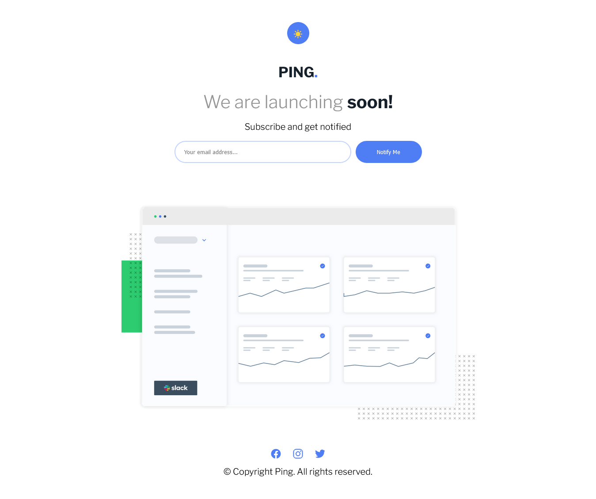
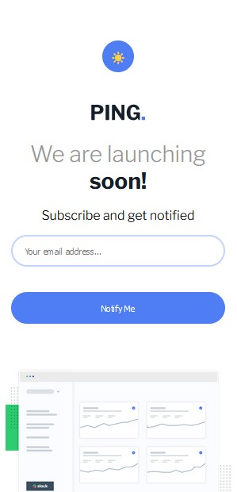
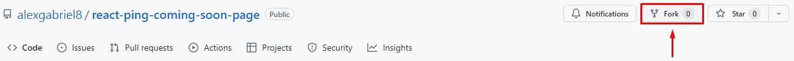
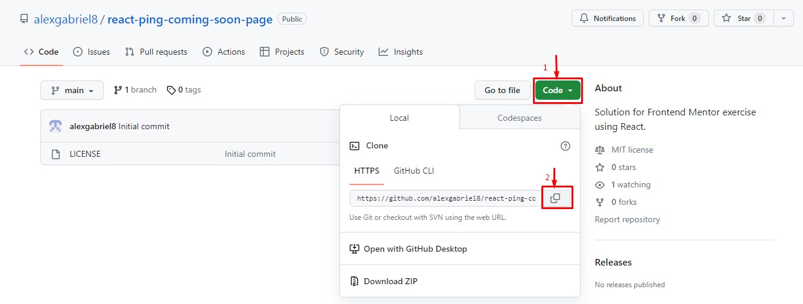

# Summary

- [The Project](#the-project)
    - [Screenshots](#screenshots)
    - [Built With](#built-with)
    - [Installation](#installation)
        - [Pre-requesites](#pre-requisites)
        - [Steps](#steps)

# The Project

This is a solution made with React for a Frontend Mentor exercise where I have to make a responsible page that the user can type his email and recieve a feedback on whether or not the email is valid.

## Screnshots

Desktop:

Mobile:

## Built With

  **HTML5**

 - Semantic Tags

  **CSS3**

 - Flex

  **JavaScript**

 <ul>
   <b>React</b>

  - **Styled Components**
  - Uses **Context** to toggle between light and dark themes.
 </ul>

## Installation

Want to contribute to the repository or test it in your own machine? Follow this guide to know how:

### Pre-requisites

- [Node.js](https://nodejs.org/en/download) and NPM (can be installed together on Node.js installer)
- A terminal (I used [GIT Bash](https://git-scm.com/downloads))

### Steps

- Install Node.js and NPM.
- I reccomend installing the Git Bash because I haven't tested with another terminal and cannot guarantee the commands will be the same.
- Fork the project:

- After forking, get the URL to clone the fork:

- Open GIT Bash at the root of the project and type `git clone copied-url-here` and then wait for the repository to be cloned.
- Type `npm install` so the project's dependecies can be downloaded.
- After installing the dependencies, type `npm run start` and the terminal will give a localhost url which you can type on your browser and see the project running!